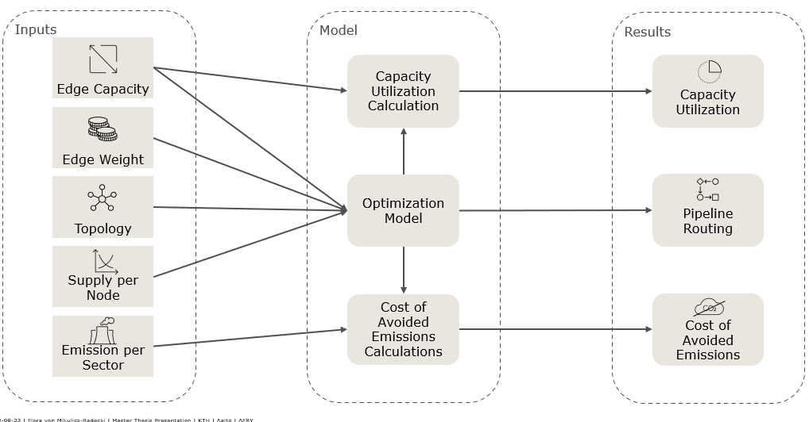
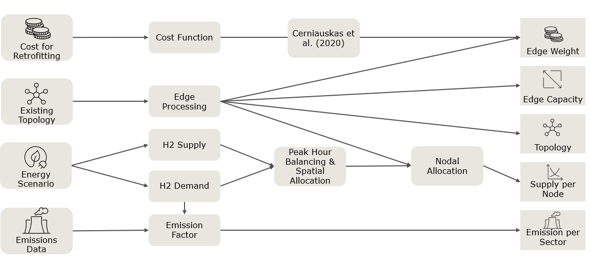
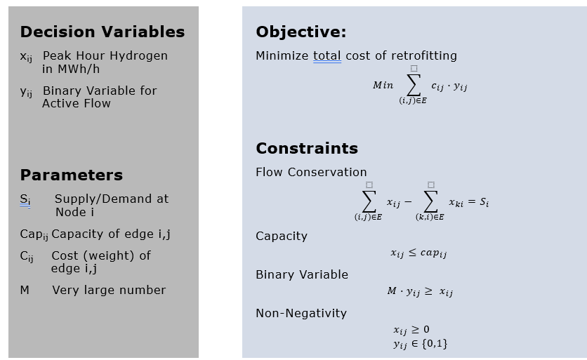

# Master Thesis on Hydrogen Pipeline Infrastructure Design for Germany in 2045

### Research Questions

1. **How can a retrofitted pipeline network be designed to fulfill the peak load requirements of a carbon-neutral Germany in 2045 while minimizing costs?**
2. **Which pipeline corridors in Germany are expected to have a high utilization rate during peak demand?**
3. **What are the potential costs of avoided emissions across different demand scenarios?**

These questions are addressed following the logic shown in the diagram below:  

---

### Inputs
The input and scenario files were prepared in Excel, as required by the company I collaborated with for this thesis. Below is a brief overview of the input factors considered in the analysis. Detailed derivations of the input parameters are available in the thesis.  

The Excel files are imported into the script for data preparation. Depending on the scenario, different demand profiles can be incorporated into the analysis.

---

### Methodology

This analysis employs a **single-period deterministic MILP optimization** to minimize retrofitting costs for the pipeline network. The model was implemented using the Python **PuLP** package.  

---

## Code Walkthrough

This section highlights key parts of the code used for optimization.

### Inputs for the PuLP Optimization
The input data is first merged and structured to define the pipeline network, including supply or demand nodes, and edges. The costs and capacities of each edge are assigned.

See https://github.com/fmvmr/h2_infrastructure_DE/blob/d2269355df6e865f02a0117e800c6b78272e9023/Scripts/MA_Model.py#L184-L221

### Parallel Pipeline Handling

One major challenge in implementing this model was handling parallel pipelines within the SciGrid dataset. These needed to be identified, and both the cost and capacity were adjusted accordingly: This was needed  due to the unique naming requirements of the edges in the dataset.
See: https://github.com/fmvmr/h2_infrastructure_DE/blob/d2269355df6e865f02a0117e800c6b78272e9023/Scripts/MA_Model.py#L94-L134

### PuLP Model Setup
A linear programming model is created using **PuLP** to minimize the total flow cost across the network. The objective function is designed to minimize costs related to retrofitting pipelines that are necessary to ensure flow.

- ** Model initiation and variable definition**
  See: https://github.com/fmvmr/h2_infrastructure_DE/blob/d2269355df6e865f02a0117e800c6b78272e9023/Scripts/MA_Model.py#L224-L231

- **Objective function**: Minimizing retrofitting costs when a pipeline is required  
  See: https://github.com/fmvmr/h2_infrastructure_DE/blob/d2269355df6e865f02a0117e800c6b78272e9023/Scripts/MA_Model.py#L234

- **Flow conservation constraint**: Ensures that at each node, inflow equals outflow  
  See: https://github.com/fmvmr/h2_infrastructure_DE/blob/d2269355df6e865f02a0117e800c6b78272e9023/Scripts/MA_Model.py#L237-L239

- **Capacity constraint**: Ensures that flow through each edge does not exceed its capacity  
  See: https://github.com/fmvmr/h2_infrastructure_DE/blob/d2269355df6e865f02a0117e800c6b78272e9023/Scripts/MA_Model.py#L241-L243

- ** Binary constraint**:
  See: https://github.com/fmvmr/h2_infrastructure_DE/blob/d2269355df6e865f02a0117e800c6b78272e9023/Scripts/MA_Model.py#L245-L247

